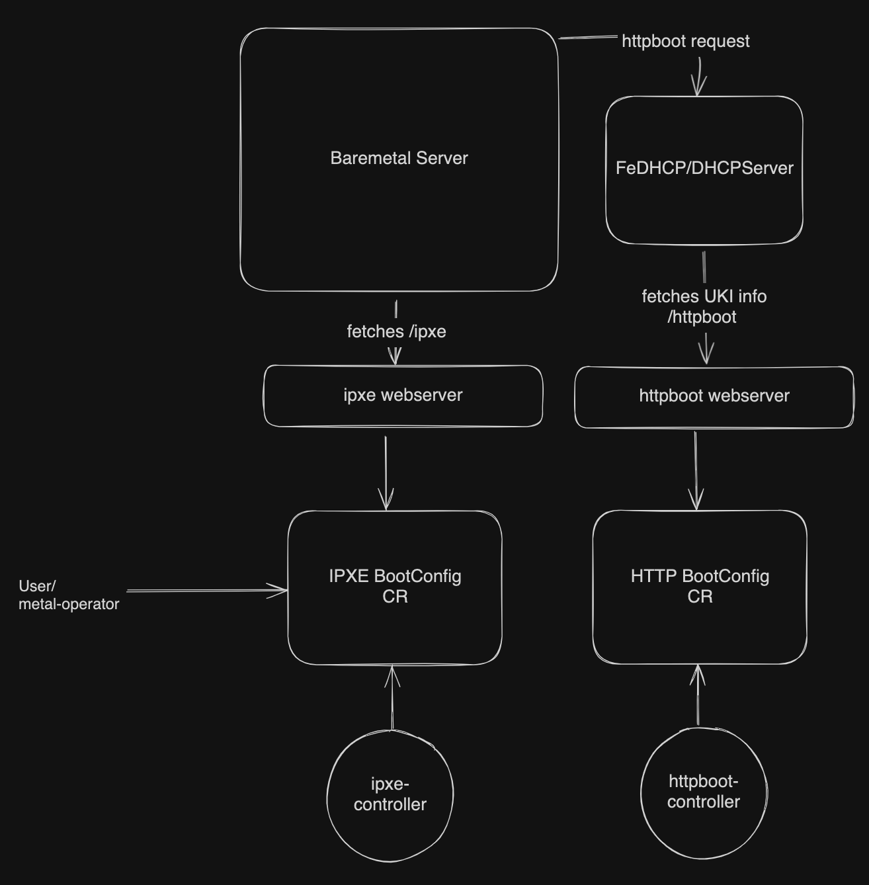
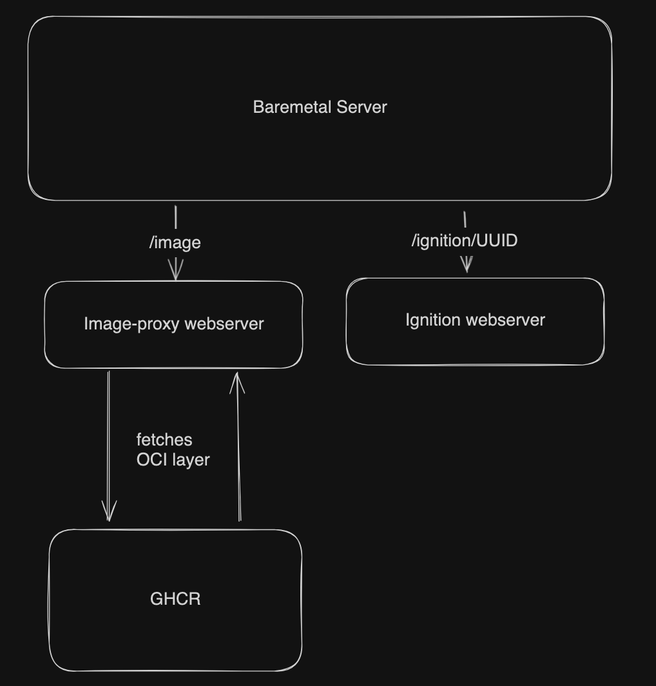

# Architecture

Boot Operator mainly consists of the a set webservers and controllers working together to fulfill the requirement of the boot process of the Baremetal machines. 

## Kubernetes API

Following are the Kubernetes CR and related controllers used to manage the boot infrastructure of the baremetal servers.

  - **IPXEBootConfig**  
    - The purpose of this CR and related controller is to allow users to configure the system to provide customised ipxe-script replies to the requests made by the baremetal servers.
    - It allows users with references tailored ignition content, and customised ipxe-scripts to the related IPXEBootConfig object. 
    - There is usually a single IPXEBootConfig object corresponding to each of the baremetal servers. 

  - **HTTPBootConfig**
    - The purpose of this CR and related controller is to allow users to configure the system to provide customised httpboot replies to the requests typically made by the DHCP servers. 
    - It allows users to reference the ignition content and customised ukiURL. 

## Architectural Diagrams

### Workflow

Although the components of Boot Operator can function independently, this section describes a typical usecases of how they work together. 

- **IPXE Workflow**  
    - The IPXE workflow involves a DHCP server (e.g., FeDHCP) and the Boot Operator deployment with the necessary IPXE configuration flags.  
    - When a bare metal server boots with the IPXE network option, it requests the `/ipxe` endpoint from the IPXE web server within the Boot Operator deployment via dhcp server. The server receives the IPXE script configured in the corresponding `IPXEBootConfig` object.  
    - The server then fetches the Ignition content from the `/ignition` endpoint, as specified in the IPXE script and the configured Ignition content for the server.

- **HTTPBoot Workflow**  
    - The HTTPBoot workflow involves a specialized DHCP server (e.g., FeDHCP), the Boot Operator with HTTPBoot configuration enabled, and a UKI OS image hosted on a web server or registry.  
    - When a bare metal server boots with the HTTPBoot option, it contacts the FeDHCP server, which returns the UKI image location from the external web server. FeDHCP internally uses the `/httpboot` endpoint exposed by the Boot Operator, fetching the required information from the related `HTTPBootConfig` object.  
    - The server can then retrieve the Ignition content from the `/ignition` endpoint, as configured for the desired OS.
